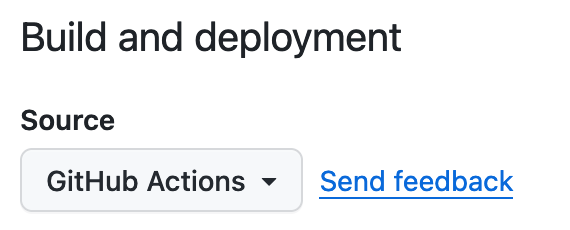

### Using Phantomake with Github Pages

[Github Pages](https://pages.github.com/) offers free hosting of static websites generated from public Github repositories. Using [Github Actions](https://github.com/features/actions), we can build and deploy a webpage using Phantomake easily.

This guide assumes you are familiar with using the terminal and [Git and Github](https://docs.github.com/en/get-started) to create and push Git repositories.

#### 1. Create a new repository

First, [create a new Github repository](https://docs.github.com/en/get-started/quickstart/create-a-repo). Note that the repository name determines the URL of your site:

- If it is named `username.github.io` (with your Github username substituted in for `username`), your webpage URL will be https://username.github.io.
- Otherwise, your webpage URL will be https://username.github.io/repositoryname

After creating the repository, you will want to [create a local git repo](https://docs.github.com/en/get-started/using-git/about-git#example-start-a-new-repository-and-publish-it-to-github) connected to it.

#### 2. Enable Pages

Head to the Settings page for your new repository, and click the "Pages" link in the sidebar. Under the "Build and Deployment" heading, click the "Source" dropdown and set it to "GitHub Actions".

<figure>
  
  <figcaption>Screenshot of the Source setting</figcaption>
</figure>

#### 3. Add a `package.json` file
In your local repository, add a `package.json` file:

<div class="code-block-with-filename">
  <div class="filename">📄 /package.json</div>

  ```json
  {
    "name": "repositoryname",
    "version": "0.1.0",
    "private": "true",
    "scripts": {
      "phantomake": "phantomake src dist",
      "watch": "phantomake watch src"
    },
    "dependencies": {
      "phantomake": "https://github.com/Osmose/phantomake/releases/latest/download/source.tar.gz"
    }
  }
  ```
</div>

This file stores the URL that we will fetch Phantomake from, as well as specifies some useful commands for previewing your website before you publish it.

#### 4. Create your initial webpage

The source directory for your webpage will be located under the `src` directory with the repository. Create the `src` directory and add a placeholder HTML file:

<div class="code-block-with-filename">
  <div class="filename">📄 /src/index.html</div>

  ```html
  <!DOCTYPE html>
  <html lang="en">
    <head>
      <meta charset="utf-8">
      <meta name="viewport" content="width=device-width, initial-scale=1">
      <title>My Phantomake Website</title>
    </head>
    <body>
      <p>This is my new website, made with Phantomake!</p>
    </body>
  </html>
  ```
</div>

#### 5. (Optional) Test your webpage locally

If you've [downloaded and installed](../download.html) Phantomake, you can preview your webpage with the watch command:

```sh
phantomake watch src
```

The HTML page above should be available at http://localhost:8000 in your web browser.

Alternatively, if you have [Bun](https://bun.sh/) installed, you can install Phantomake as a dependency and use the helper scripts from the `package.json` file:

```sh
bun install
bun watch
```

In watch mode, Phantomake will rebuild your website if any files in the source directory change, which is very useful for quickly previewing changes to your website.

#### 6. Configure Github Actions

The last step before deploying your webpage is to tell Github Actions how to build your webpage with Phantomake. To do this, create a file under the `.github/workflows` directory within your repository:

<div class="code-block-with-filename">
  <div class="filename">📄 /.github/workflows/build.yml</div>

  ```yaml
  name: Build and deploy site
  on:
    push:
      branches: ['main'] # Your website will be built every time you push to the `main` branch
    workflow_dispatch: # Allows you to run this workflow manually from the Actions tab
  permissions:
    contents: read
    pages: write
    id-token: write
  concurrency:
    group: 'pages'
    cancel-in-progress: false
  jobs:
    build-deploy:
      environment:
        name: github-pages
        url: ${{ steps.deployment.outputs.page_url }}
      runs-on: ubuntu-latest
      steps:
        - name: Setup bun
          uses: oven-sh/setup-bun@v1
          with:
            bun-version: latest
        - name: Check out repository code
          uses: actions/checkout@v4
        - name: Bun install
          run: |
            bun install
        - name: Build site
          run: |
            bun phantomake
        - name: Setup Pages
          uses: actions/configure-pages@v3
        - name: Upload artifact
          uses: actions/upload-pages-artifact@v2
          with:
            path: 'dist'
        - name: Deploy to GitHub Pages
          id: deployment
          uses: actions/deploy-pages@v2
  ```
</div>

This [workflow file](https://docs.github.com/en/actions/using-workflows/about-workflows) sets up Github Actions to download and install Phantomake, generate your website with it, and then upload it to Github Pages. It will automatically do this every time you push to the `main` branch of your repository.

#### 7. Publish!

Commit your changes and push them to the remote Github repository. After pushing, you should be able to click the "Actions" tab on your repository and see an action corresponding to your push. If there's an issue with building your webpage, the logs on the Actions tab can help you diagnose the issue.

Once the action completes, your webpage should be available at the URL discussed above. It may take a few seconds or minutes to update to the latest version; if you don't see your updates immediately, try refreshing the page a few times and clearing your browser caches.
