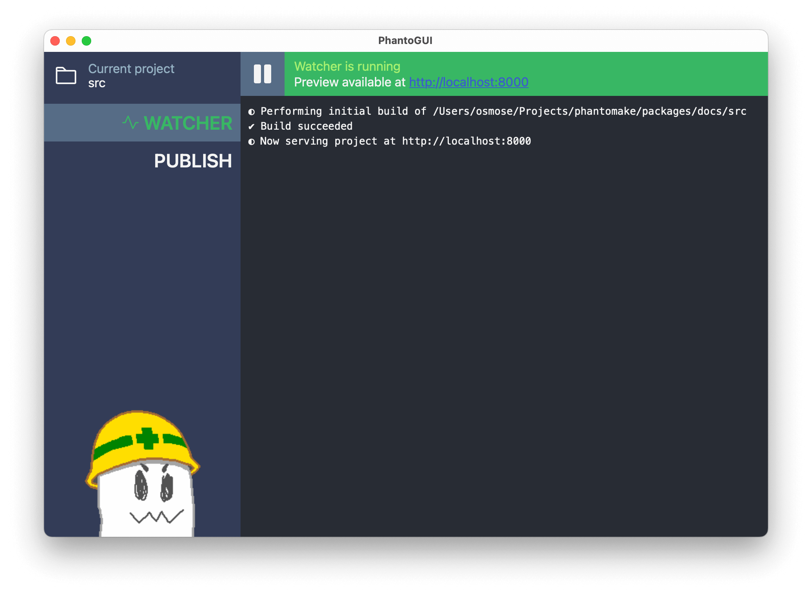

### How to run Phantomake

There are two ways to run Phantomake:

- If you are comfortable with using a terminal, use the [terminal command](#terminal-command).
- If you don't want to use the terminal, then try [PhantoGUI](#phantogui).

### Terminal Command

Phantomake is a terminal command. If you're unfamiliar with using a terminal, [MDN has a tutorial that can teach you the basics](https://developer.mozilla.org/en-US/docs/Learn/Tools_and_testing/Understanding_client-side_tools/Command_line).

Phantomake has two subcommands: `build` and `watch`. If no subcommand is given, it will default to the `build` subcommand.

#### `phantomake [build] <source_directory> <output_directory>`

The `build` subcommand runs Phantomake on a source directory, processes the source files into output, and saves that output to the output directory.

> [!NOTE]
> Phantomake will overwrite any existing files that match an output file it is writing, but it does not delete existing files in the output directory that _don't_ conflict with any output.

```sh
# Processes files in `src` and output them to the `dist` directory
phantomake ./src ./dist
```

#### `phantomake watch <source_directory>`

The `watch` subcommand makes working on a Phantomake-generated site much more convenient. It watches the source directory and automatically rebuilds on any file changes. The output is written to a temporary directory and is made viewable on a local development server. By default this is [http://localhost:8000](http://localhost:8000) but can be customized with the `--host` and `--port` options if needed.

```sh
# Watches `src` for changes and hosts the build output at http://localhost:8000
phantomake watch ./src
```

### PhantoGUI



PhantoGUI allows you to run Phantomake without having to use the terminal. It includes:

- A tab for launching and monitoring the **Watcher** preview of your output site.
- A **Publish** tab for building and saving your output to a local directory.

PhantoGUI runs on Linux, MacOS, or Windows and can be downloaded from the [Downloads](download.html) page.
